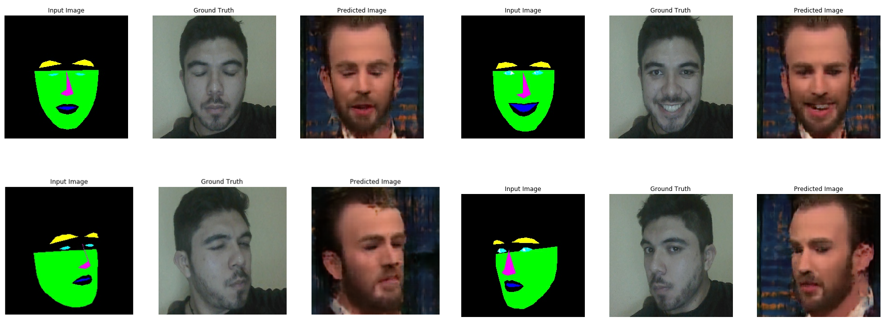

# face2face

Proyecto para las materias de "Aprendizaje (Máquina)" y "Reconocimiento de
patrones" de la FI, UNAM, semestre 2020-1

## Propuesta de proyecto

Implementar una red neuronal basada en la arquitectura pix2pix que sea capaz de
generar rostros con expresiones faciales distintas a las proporcionadas en el
conjunto de datos de entrenamiento, tomando como referencia la posición de otro
rostro.

A continuación se muestra un ejemplo de la aproximación que se desea lograr.

## Integrantes

- **Aprendizaje (Máquina)**
  - Aguilar Enriquez, Paul Sebastian
  - Cabrera López, Oscar Emilio
- **Reconocimiento de patrones**
  - Aguilar Enriquez, Paul Sebastian
  - Padilla Herrera Carlos Ignacio
  - Ramírez Ancona Simón Eduardo

## Requerimientos

- `tensorflow-gpu`
- `matplotlib`
- `numpy`
