# face2face

Proyecto para las materias de **_Aprendizaje (Máquina)_** y **_Reconocimiento de
patrones_** de la FI, UNAM, semestre 2020-1

## Propuesta de proyecto

Implementar una red neuronal basada en la arquitectura pix2pix que sea capaz de
generar rostros con expresiones faciales distintas a las proporcionadas en el
conjunto de datos de entrenamiento, tomando como referencia la posición de otro
rostro. A esta técnica se le conoce generalmente como **DeepFake**.

## Integrantes

- **Aprendizaje (Máquina)**
  - Aguilar Enriquez, Paul Sebastian
  - Cabrera López, Oscar Emilio
- **Reconocimiento de patrones**
  - Aguilar Enriquez, Paul Sebastian
  - Padilla Herrera Carlos Ignacio
  - Ramírez Ancona Simón Eduardo

## (Introducción) Conceptos teóricos

### Deepfake

Deepfake un acrónimo de "deep learning (aprendizaje profundo)" y "fake (falso)",
técnica en la cual se toma a una persona en una imagen o video existente y se le
reemplaza con la imagen de otra persona usando redes neuronales artificiales.

A menudo se combinan y superponen archivos multimedia existentes en de origen
utilizando técnicas de aprendizaje automático conocidas como autoencoders y
redes de confrontación generativa (Generative Adversarial Networks, GANs).

<div align="center">


Un ejemplo de tecnología deepfake: la actriz Amy Adams en el original
(izquierda) se modifica para tener la cara del actor Nicolas Cage (derecha)
</div>

### OpenCV

Es una **biblioteca libre de visión artificial** originalmente **desarrollada
por Intel**. Desde que apareció su primera versión alfa en el mes de enero de
1999, se ha utilizado en infinidad de aplicaciones. Desde sistemas de seguridad
con detección de movimiento, hasta aplicaciones de control de procesos donde se
requiere reconocimiento de objetos. Esto se debe a que su publicación se da bajo
**licencia BSD**, que permite que sea usada libremente para propósitos
comerciales y de investigación con las condiciones en ella expresadas.

Open CV es **multiplataforma**, existiendo versiones para GNU/Linux, Mac OS X,
Windows y Android. Contiene más de 500 funciones que abarcan una gran gama de
áreas en el proceso de visión, como reconocimiento de objetos, reconocimiento
facial, calibración de cámaras, visión estérea y visión robótica.

### Detección de rostros con OpenCV

Desde su versión 3.3, OpenCV cuenta con funciones de
**detección de rostros basado en aprendizaje profundo**. Estas funciones
pertenecen al modulo de **redes neuronales profundas (dnn)**.

El modulo de dnn incluye soporte para Caffe, TensorWlof y Torch/PyTorch. Su
principal contribuidor es **Aleksandr Rybnikov**.

Para utilizar las funciones de detección de rostros del modulo dnn se requieren
los archivos correspondientes con el modelo y los pesos del mismo.

En el caso de un un modelo con modulos para Caffe, se requieren:

- Archivo **.prototxt** que define la **arquitectura del modelo**.
- Archivo **.caffemodel** que contiene los **pesos** para las capas del modelo.

El detector facial de aprendizaje profundo de OpenCV se basa en un **Single Shot
Detector (Detector de disparo único), SSD, con una red base de ResNet**.

<div align="center">


Detección de rostro con el modulo DNN de OpenCV.

</div>


### Segmentación de rostros con OpenCV y Dlib

**Dlib es una biblioteca de aprendizaje automático** escrita en C ++.
Implementa una amplia gama de algoritmos que se pueden usar en plataformas de
escritorio y móviles.

Dlib permite realizar detección de rostros mediante
**Face Landmark Localization**. El proceso permite extrapolar un conjunto de
puntos clave a una imagen de un rostro.

Los puntos de referencia (puntos clave) que nos interesan son los que describen
la forma de los atributos de la cara como: ojos, cejas, nariz, boca y mentón.

Estos puntos dan una idea sobre la estructura de la cara analizada, que puede
ser muy útil para una amplia gama de aplicaciones, que incluyen: reconocimiento
de rostros, animación de rostros, reconocimiento de emociones, detección de
parpadeo y fotografía.

Hay muchos métodos que pueden detectar estos puntos: algunos logran una
precisión y robustez superiores mediante el análisis de un modelo de cara 3D
extraído de una imagen 2D, otros confían en el poder de CNNs (redes neuronales
convolucionales) o RNNs (redes neuronales recurrentes), y otros más utilizan
características simples (pero rápidas) para estimar la ubicación de los puntos.

El algoritmo **Face Landmark Detection** ofrecido por Dlib es una
**implementación del conjunto de árboles de regresión (ERT)** presentado en 2014
por **Kazemi y Sullivan**. Esta técnica utiliza una función simple y rápida de
**diferencias de intensidades de píxeles** para estimar directamente las
posiciones de referencia. Estas posiciones estimadas se refinan posteriormente
con un proceso iterativo realizado por una **cascada de regresores**. Los
regresores producen una nueva estimación de la anterior, tratando de reducir el
error de alineación de los puntos estimados en cada iteración. El algoritmo es
increíblemente rápido, de hecho, se necesitan entre 1 y 3 ms (en la plataforma
de escritorio) para detectar (alinear) un conjunto de 68 puntos de referencia en
una cara determinada.

Existe un dataset para utilizar adecuadamente el predictor llamado
**shape_predictor_68_face_landmarks**, el cual está entrenado en el conjunto de
datos **[ibug 300-W](https://ibug.doc.ic.ac.uk/resources/facial-point-annotations/)**
de **C. Sagonas, E. Antonakos, G, Tzimiropoulos, S. Zafeiriou, M. Pantic.**
con 300 caras, y permite indicar mediante un conjunto de 68 puntos elementos
del rostros.

La licencia para este conjunto de datos excluye el uso comercial y Stefanos
Zafeiriou, uno de los creadores del conjunto de datos, pidió que no puede usarse
en un producto comercial.

Para este detector se utilizo una CNN.

<div align="center">


Puntos del predictor llamado shape_predictor_68_face_landmarks.

</div>

### pix2pix (Image-to-Image Translation with Conditional Adversarial Networks)

**pix2pix** es el nombre de la arquitectura propuesta en el paper
**Image-to-Image Translation with Conditional Adversarial Networks** de Phillip
Isola, Jun-Yan Zhu, Tinghui Zhou, Alexei A. Efros del Berkeley AI Research
(BAIR) Laboratory de la UC Berkeley.

El paper es una investigación sobre las redes adversas condicionales como una
solución de propósito general para los problemas de traducción de imagen a
imagen. Estas redes no solo aprenden el mapeo de la imagen de entrada a la
imagen de salida, sino que también aprenden una función de pérdida para entrenar
este mapeo. Esto hace posible aplicar el mismo enfoque genérico a problemas que
tradicionalmente requerirían formulaciones de pérdidas muy diferentes.

En el paper se demostró que este enfoque es efectivo para sintetizar fotos a
partir de mapas de etiquetas, reconstruir objetos a partir de mapas de bordes e
colorear imágenes, entre otras tareas. Como comunidad, ya no se diseña a mano
las funciones de mapeo, y este trabajo sugiere que se pueden lograr resultados
razonables sin diseñar a mano las funciones de pérdida.

**En resumen:**

- Estas redes(cGAN) aprenden el mapeo de la entrada a la salida y una función de
pérdida para entrenar el mapeo mismo.
- Se vuelve posible aplicar un acercamiento genérico a problemas que
tradicionalmente requieren diferentes funciones de pérdida.

El paper ha tenido tres revisiones (2017, 2018, 2019).

- [Sitio del proyecto](https://phillipi.github.io/pix2pix/)
- [Enlace al paper](https://arxiv.org/abs/1611.07004)

### Funcionamiento de pix2pix

- Utiliza una red generativa adversaria condicional (cGAN) para aprender el mapeo
de la entrada a la salida.
- Utiliza un Generador y un Discriminador.
- El Generador aplica alguna transformación a la entrada para obtener la salida.
- El Discriminador compara la imagen de entrada con una desconocida (la
  generada) y trata de de identificar si esta fue producida por el generador.

### Ejemplo de funcionamiento de pix2pix

<div align="center">

Un ejemplo de imágenes en blanco y negro que deseamos sean coloreadas.

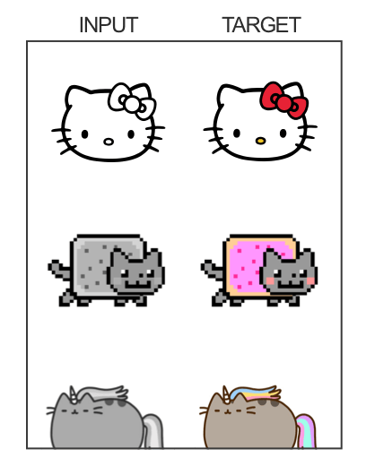

<br/><br/>

El **generador** intenta aprender a colorear la imagen.

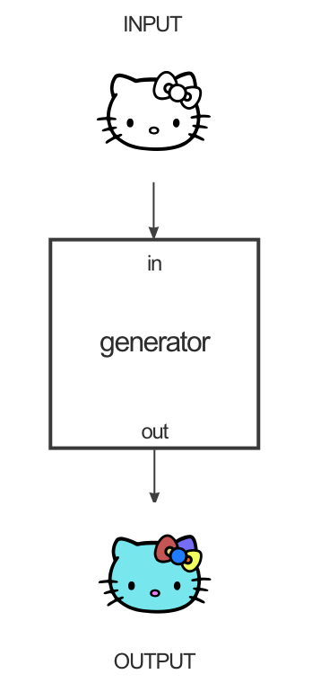

<br/><br/>

El **discriminador** analiza la colorización realizada por el generador e intenta
aprender a indicar si la colorización fue correcta o no.

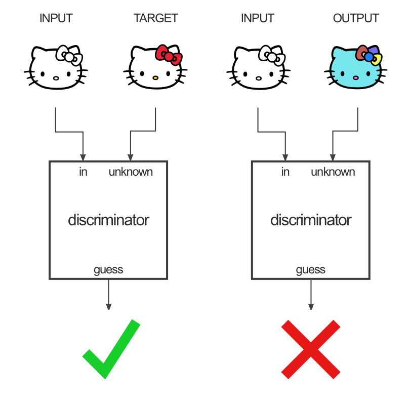

<br/><br/>

El **generador** utiliza una estructura codificador-decodificador.

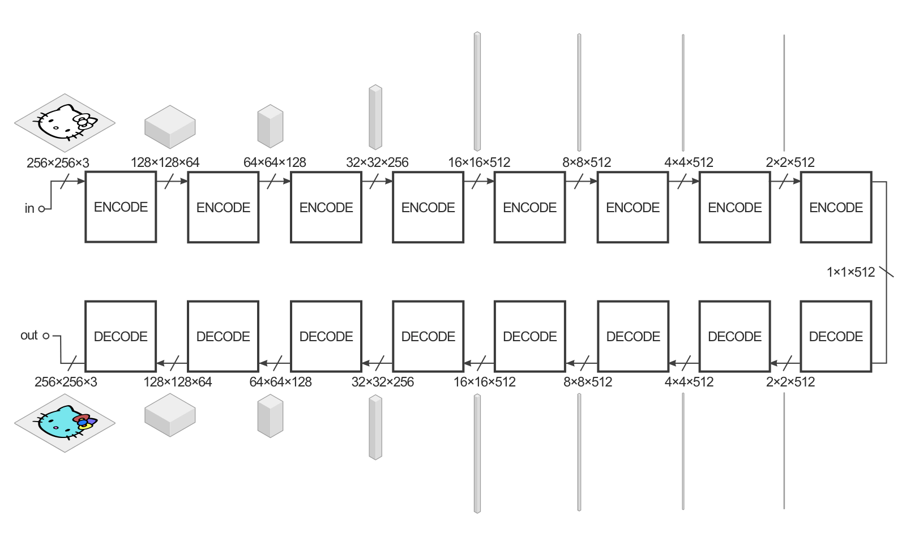

<br/><br/>

- La entrada se intenta reducir con una serie de codificadores (convolución +
  función de activación) en una representación mucho más pequeña.
- Al comprimirlo de esta manera, esperamos tener una representación de nivel
superior de los datos después de la capa de codificación final.
- Las capas de decodificación hacen lo contrario (deconvolución + función de
  activación) e invierten la acción de las capas del codificador.


<br/><br/>

Para mejorar el rendimiento de la transformación de imagen a imagen se utiliza
una "U-Net" en lugar de un codificador-decodificador. Esto es lo mismo, pero con
"skip connections (conexiones de omisión)" conectando directamente las capas del
codificador a las capas del decodificador.

Las conexiones de omisión le dan a la red la opción de omitir la parte de
codificación/decodificación si no tiene un uso para ella.

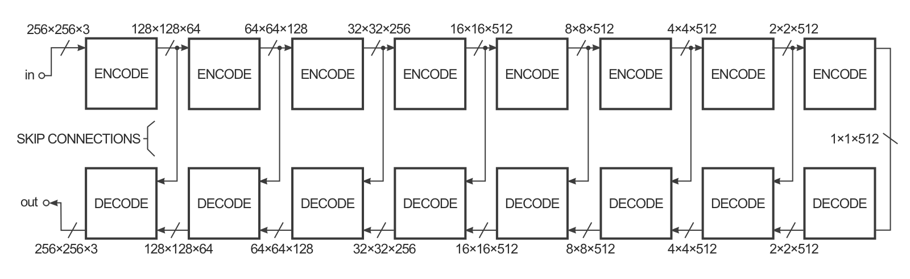

<br/><br/>

El **discriminador** toma dos imágenes, una imagen de entrada y una imagen
desconocida (que será una imagen objetivo o de salida del generador), y decide
si la segunda imagen fue producida por el generador o no. La estructura se
parece mucho a la sección del codificador del generador, pero funciona de manera
diferente. La arquitectura se llama **PatchGAN**.

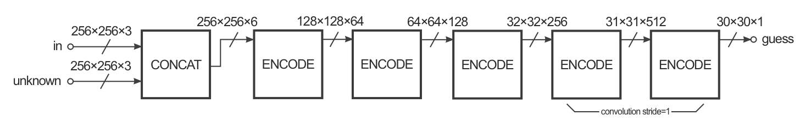

<br/><br/>

**Para entrenar esta red**, se requiere entrenar al discriminador y entrenar al
generador.

Para entrenar al discriminador, primero el generador genera una imagen de salida.
El discriminador mira el par de entrada/destino y el par de entrada/salida y
genera su conjetura sobre cuán realistas se ven. Los pesos del discriminador se
ajustan en función del error de clasificación del par de entrada/salida y el par
de entrada/destino.

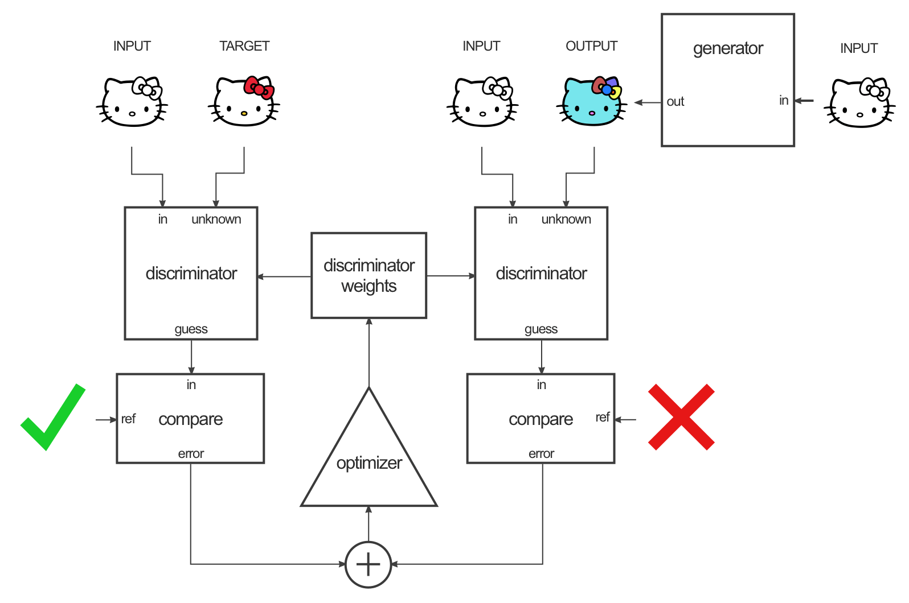

<br/><br/>

Los pesos del generador se ajustan en función de la salida del discriminador,
así como la diferencia entre la imagen de salida y de destino.

El truco es que cuando entrenas al generador en la salida del discriminador, en
realidad estás calculando los gradientes a través del discriminador, lo que
significa que mientras el discriminador mejora, estás entrenando al generador
para vencer al discriminador.

La teoría es que a medida que el discriminador mejora, también lo hace el
generador. Si el discriminador es bueno en su trabajo y el generador es capaz de
aprender la función de mapeo correcta a través del descenso de gradiente,
debería obtener resultados generados que podrían engañar a un humano.


<br/><br/>

Ejemplo de resultados utilizando pix2pix.


</div>

## Desarrollo

El desarrollo del proyecto esta dividido en dos notebooks de `Jupyter Notebook`.

El primero es para el **preprocesamiento** y el segundo para la arquitectura de
**pix2pix**.

### Implementación

#### Preprocesamiento

El preprocesamiento es para la creación del dataset Se parte de dos videos de
entrada, uno que funcionara para la creación de imágenes de entrenamiento y otro
para la creación de imágenes de prueba. A los videos se les aplican las
siguientes funciones:

- **Extracción de frames del video:** A través de la biblioteca de `OpenCV` se
extraen los frames de este para ser almacenados como imágenes. Se puede indicar
cada cuantos frames se almacena una imagen, esto se puede considerar un
parámetro de muestreo. Los frames extraidos se almacenan en una carpeta a la
cual podemos considerar la carpeta de imagenes taggeadas o deseadas a generar.
- **Detección de rostros en los frames**: Se utiliza un modelo de aprendizaje
profundo que viene incluido en `OpenCV`. En esta parte se hace la detección del
rostro en el frame, y la imagen se recorta a un formato de 256x256 con solamente
el rostro en ella. La imagen se sigue almacenando en la carpeta de de imágenes
taggeadas.
- **Creación de mascaras de rostros a partir de los rostros detectados**: Se
utiliza la biblioteca `dlib` junto al algoritmo de detección de rostro basado en
puntos. Se toman las imágenes taggeadas y de cada rostro se hace la detección
de sus elementos correspondientes: base del rostro, ojos, cejas, nariz y boca.
De los elementos detectados se genera una mascara con estos y un fondo negro.
Estas imágenes se almacenan en una carpeta  a la cual se considera la carpeta de
imágenes de entrada.

| Frame extraido | Rostro detectado y recortado  | Mascara generada |
| - | - | - |
| 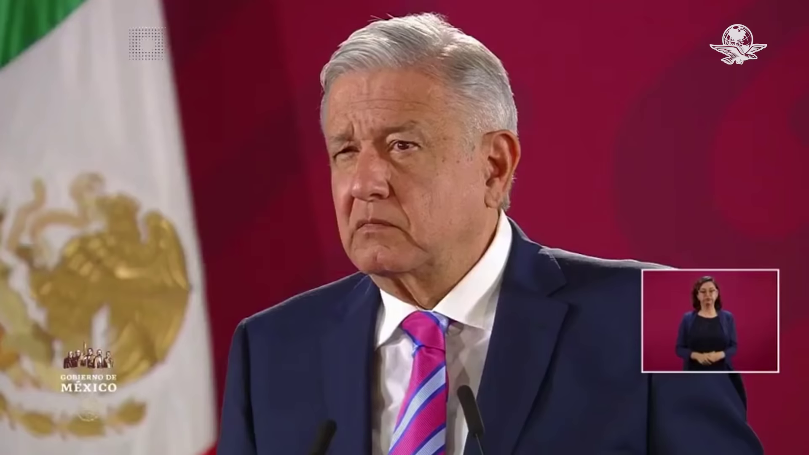 | 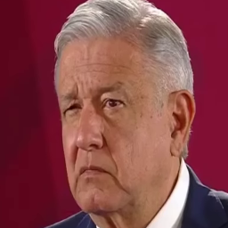 | 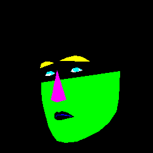 |
| 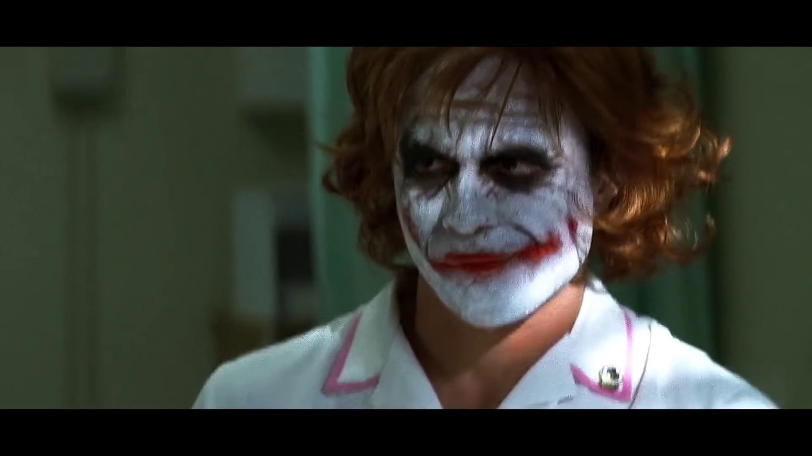 | 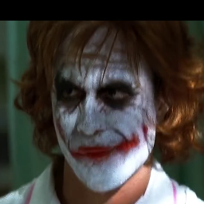 | 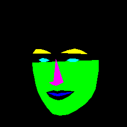 |

El preprocesamiento implementado tiene algunos errores, por lo cual hay que
eliminar algunas imágenes a mano ya que no en todos los frames se logra detectar
un rostro, por lo cual no se genera la mascara y hay que eliminarlos para que no
metan ruido a pix2pix.

#### pix2pix

La arquitectura implementada es literalmente la propuesta en el paper de
original. Se utilizo `TensorFlow2` como herramienta de desarrollo y se configuró
para el uso de GPU.

Para la definición del set datos se indican cuatro carpetas. Dos carpetas
corresponden a las imágenes de entrada como mascaras, y dos corresponden a las
imágenes de entrada taggeadas o deseadas a generar (objetivo). Así como la
carpeta de salida.

```python
# Definimos carpetas donde se ubican las imagenes
TAGPATHTRAIN = './tagged_train'
INPATHTRAIN = './input_train'
TAGPATHTEST = './tagged_test'
INPATHTEST = './input_test'
OUTPATH = './output'
```

Se especifica la cantidad de trabajos para trabajar y el porcentaje que se
utilizara como entrenamiento.

```python
# Cantidad de imagenes con las que vamos a trabajar
n = 400
# Porcentaje de nuestro set a ser utilizado como entrenamiento
train_percentage = 0.80
```

Como se mencionó, se implementa todo lo indicado en el paper:

- Funciones procesamiento de imágenes
  - Reescalado
  - Normalización
  - Random jitter
- Carga de imágenes para entrenamiento y prueba
- Bloques básicos para el generador y el discriminador
  - downsample
  - upsample
- Generador
- Discriminador
- Funciones de costo del generador y del discriminador
- Funciones de medición de rendimiento y carga de imágenes
- Funciones de entrenamiento
  - Pasos (Incluye el gradiente descendente)
  - Entrenamiento general
- Configuraciones para almacenamiento de checkpoints y optimización dentro de
TensorFlow

Todas estas funciones se utilizan de manera secuencial y se explica el flujo a
continuación:

- Se cargan los set de datos:
  - Se normalizan a valores de [-1, 1].
  - Se indica cual es el set de entrenamiento para que se le apliquen
  operaciones de variación en las imágenes (reescalado, recorte aleatorio y
    espejeo).
  - Se indica cual es el set de prueba para que no se le apliquen operaciones de
  variación en las imágenes.
- Se crea el generador y el discriminador a partir de los bloques de upsample y
downsample, así como de otras operaciónes.
- Se entrena la red con los siguientes pasos:
  - Se evalúa la función de costo y se aplica gradiente descendente.
  - Se crea una imagen con el generador.
  - Se compara una imagen con el discriminador.
  - Se hace el ajuste de pesos entre generador y discriminador.

La arquitectura de la red queda de la siguiente manera:

<div align="center">

**Generador**, basado en una red **U-Net**.

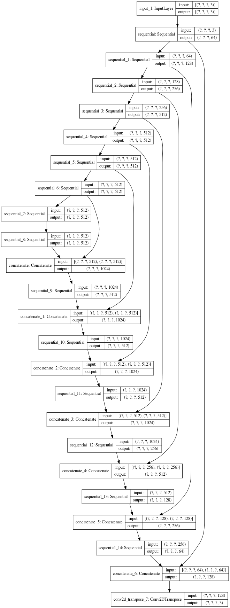

<br/><br/>

**Discriminador**, basado en una red **PatchGAN**.

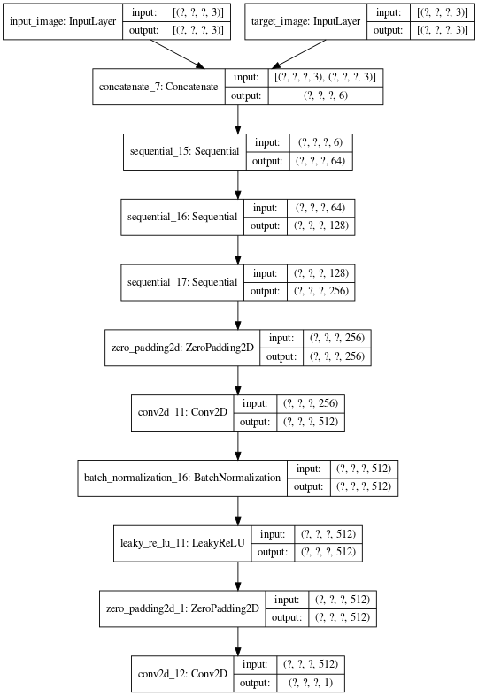

<br/><br/>
</div>

### Requerimientos

- `Jupyter Notebook 5.6`
- `python=3.5.6`
- `tensorflow-gpu`
- `matplotlib`
- `numpy`
- `pydot`
- `pillow`
- `opencv`
- `dlib`

### Ejecución

El preprocesamiento se realiza con `python=3.5.6` y la parte de pix2pix con
`python=3.7.5`.

## Resultados


## Referencias

- [DeepFake](https://en.wikipedia.org/wiki/Deepfake)
- [OpenCV](https://es.wikipedia.org/wiki/OpenCV)
- [Site: Image-to-Image Translation with Conditional Adversarial Nets](https://phillipi.github.io/pix2pix/)
- [Image-to-Image Translation in Tensorflow](https://affinelayer.com/pix2pix/)
- [Face detection with OpenCV and deep learning](https://www.pyimagesearch.com/2018/02/26/face-detection-with-opencv-and-deep-learning/#post_downloads)
- [Open Source Computer Vision Library](https://github.com/opencv/opencv/tree/master/samples/dnn/face_detector)
- [Face detection using OpenCV and Dlib - A Comparison ](https://github.com/arunponnusamy/face-detection-comparison)
- [computer_vision/CAFFE_DNN](https://github.com/thegopieffect/computer_vision/tree/master/CAFFE_DNN)
- [Training alternative Dlib Shape Predictor models using Python](https://medium.com/datadriveninvestor/training-alternative-dlib-shape-predictor-models-using-python-d1d8f8bd9f5c)
- [ Trained model files for dlib example programs](https://github.com/davisking/dlib-models)
- [Edge to Artworks translation with Pix2Pix model. ](https://github.com/gallardorafael/edge2art)
- [Proyecto DeepFake que busca crear en ultima instancia caras falsas usando landmarks del controlador o entrada de texto ](https://github.com/RonyBenitez/mimix)
- [Generando FLORES realistas con IA - Pix2Pix | IA NOTEBOOK #5](https://www.youtube.com/watch?v=YsrMGcgfETY)
- [Pix2Pix con TensorFlow](https://www.tensorflow.org/tutorials/generative/pix2pix)
